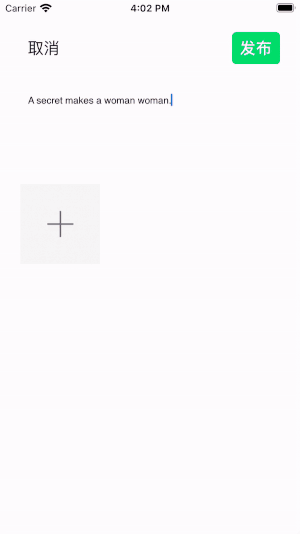
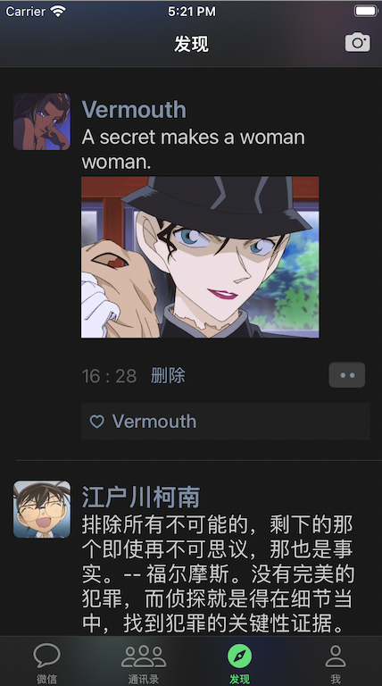

# WeChat
## 1 简要介绍

### 1.1 基本信息

- 制作者：宋嘉明
- 制作内容：微信部分功能的仿写
- 使用语言：Objective-C

### 1.2 程序架构与使用的第三方框架

- 使用MVC设计模式
- 主要使用Masonry第三方框架来设置控件位置和实现屏幕适配
- 借助YYText框架实现富文本
- 主要使用WCDB来数据存储

## 2 APP概要与主要功能

### 2.1 登录

 

### 2.2 主界面

简单的`UITableView`, 无法进入聊天界面，数据从plist文件中加载。

 

### 2.3 通讯录界面

和主界面一样是简单的UITableView，数据从plist文件中加载。

有搜索框功能。

 

### 2.4 朋友圈界面

#### 2.4.1 主界面

头部视图可下拉显示更多图片

原始数据由plist文件提供 

利用YYText框架进行富文本编排

 

#### 2.4.2 点赞

点击多功能按钮有弹窗弹出，点击点赞按钮后会有点赞特效动画。

点赞情况会同步到本地

 

#### 2.4.3 评论

点击多功能弹窗中的评论按钮，进入评论界面，在没有内容时，发布按钮为灰色且不可点击。发表后会在评论区显示，同时储存在本地。

 

#### 2.4.4 发布朋友圈

- 点击顶部的发布按钮进入发布界面

  有内容时，发布按钮变绿，可点击

  点击取消按钮，可保存草稿内容

   

- 下一次进入发布界面时会出现上一次保存的草稿

  点击加号可选择本地相册中的图片，一次最多选择9张，在满9张后加号会消失，不可选择图片，同时发布的最多也是9张。

  内容下方的时间和发布时间一致。

  发布的内容也会同步到本地。

   

#### 2.4.5 删除自己发布的朋友圈

点击时间旁边的删除按钮，可实现此条内容删除。

 

#### 2.4.6 点击图片放大与保存

点击图片可以实现放大效果，再次点击恢复。

可以看到，开始时相册里有54张图片，点击图片保存按钮后，变为55张，最新一张即为点击保存的那张。

 

#### 2.4.7 数据都储存在本地

可以看到，即使重启应用，数据仍然存在。

 

### 2.5 我界面

#### 2.5.1 点击头像，可更换头像

朋友圈界面的图像经过刷新也会显示新的。

 

#### 2.5.2 退出

退出后再次启动，也会在登录界面

 

### 2.6 可适配黑暗模式

  

## 3 重要技术点

- **利用WCDB进行数据存储：**

  朋友圈plist文件里的原始数据也会在第一次加载时加入到本地

  主要是对朋友圈发布内容，点赞，评论和头像的数据储存，增删改查功能

- **朋友圈数据的存储使用栈的数据结构**

- **朋友圈界面动态变化的UI：**

  借助`YYText`进行富文本的编排，根据数据选择合适的UI（例如只有内容没有点赞评论的，只有内容与点赞信息的，内容点赞评论都有的），还有由于`YYText`的一些局限性，部分控件没有办法在`YYLabel`上显示，需要自己进行布局

- **发布图片的一些算法：**

  图片的原始尺寸不一，布局时需要计算到一个合适的位置，以及宽高适配，使长方形的图片放在正方形的位置里不会变形

- **利用`UICollectionView`放置图片**

- **利用`PHPicker`添加本地照片**

- **评论与朋友圈成功发布后利用`block`的回调功能，在朋友圈主界面显示新内容**

- **图片的放大保存：**

  封装了`SKKImageZoom`来进行放大保存操作

## 4 心得体会

这次的大作业整体难度不高，但很好的结合了**数据存储**与**block回调**的知识点。除此之外，让我借此机会学习并使用一些别的功能，例如图片的保存与获取，WCDB数据存储，还有`YYText`框架的初步使用。对细节的打磨，让我之前忘的差不多的动画也有机会展现。

- 不足

  由于`YYText`的限制，除却删除本地数据库外，暂时无法做到直接删除评论功能。

  图片放大后不能滑动到下一张图片

